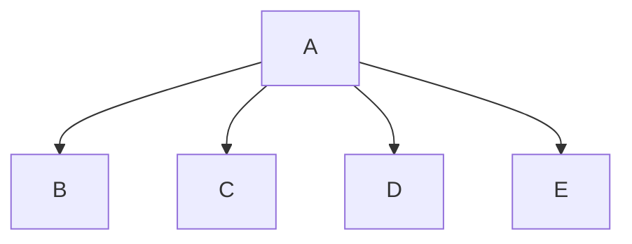

# Chapter-6-Project

# Program Name
Kyle, Mason, Gideon

## Travel Expenses Desc
Outputs the total days on the trip, the time of departure, the amount of round-trip afaire, amount of car rentals,
miles driven, parking fees, taxi fees, conference/seminar registration fees, hotel expenses,
and the amount of each meal eaten.

### Travel Expenses Flowchart

#### Function Diagrams

| `function name1`    |               |  author     |
| ------------------ | ------------- | ------------ |
| `argument:type`    | takes input from the user for ____  |              |
| `time:integer`     | calculates ______  | outputs ____             |
| `name:string`      | takes input for name ___ | returns total |
***
| `function name2`    |               |     author   |
| ------------------ | ------------- | ------------ |
| `argument:type`    | takes input from the user for ____  |              |
| `time:integer`     | calculates ______  | outputs ____             |
| `name:string`      | takes input for name ___ | returns total |
***
