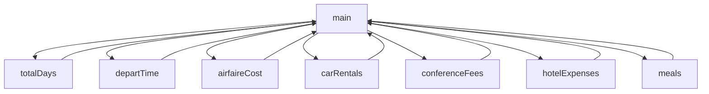

# Chapter-6-Project

# Travel Expenses
Kyle, Mason, Gideon

## Travel Expenses Desc
Outputs the total days on the trip, the time of departure, the amount of round-trip affaire, amount of car rentals,
miles driven, parking fees, taxi fees, conference/seminar registration fees, hotel expenses,
and the amount of each meal eaten.

### Travel Expenses Flowchart

#### Function Diagrams

| Function Name       | Description                         | Developer       |
| ------------------- | ----------------------------------- | --------------- |
| `main`              | Calculates and outputs the total cost of the trip. | Kyle          |
| **Arguments**       | `double`: takes user input for N/A. |                |
| **Time**            | `integer`: calculates the cost of the trip. | Outputs cost.  |
| **Name**            | `string`: takes input for N/A.      | Returns N/A.   |

***

| `totalDays`         | Counts total days spent on trip.     | Kyle           |
| **Arguments**       | `double`: takes user input for days spent. |             |
| **Time**            | `integer`: N/A.                      | Outputs N/A.   |
| **Name**            | `string`: receives days.             | Returns days.  |

***

| `departTime`        | Records departure and arrival times. | Mason          |
| **Arguments**       | `double`: departure and arrival times. |              |
| **Time**            | `integer`: N/A.                      | Outputs N/A.   |
| **Name**            | `string`: receives times.            | Returns times. |

***

| `airfaireCost`      | Calculates round-trip airfare cost.  | Mason          |
| **Arguments**       | `double`: amount for round-trip airfare. |              |
| **Time**            | `integer`: N/A.                      | Outputs N/A.   |
| **Name**            | `string`: receives airfare amount.   | Returns total. |

***

| `carRentals`        | Records car rental costs.            | Gideon         |
| **Arguments**       | `double`: rental cost.               |                |
| **Time**            | `integer`: N/A.                      | Outputs N/A.   |
| **Name**            | `string`: receives car rental cost.  | Returns total. |

***

| `conferenceFees`    | Records conference registration fees. | Mason         |
| **Arguments**       | `double`: registration fee.          |                |
| **Time**            | `integer`: N/A.                      | Outputs N/A.   |
| **Name**            | `string`: receives registration fee. | Returns total. |

***

| `hotelExpenses`     | Calculates hotel expenses.           | Gideon         |
| **Arguments**       | `double`: nightly hotel rate.        |                |
| **Time**            | `integer`: calculates total lodging costs. | Outputs N/A. |
| **Name**            | `string`: receives nightly rate.     | Returns total. |

***

| `meals`             | Records meal expenses within limits. | Gideon         |
| **Arguments**       | `double`: amount for each meal type. |                |
| **Time**            | `integer`: checks meal allowances based on time. | Outputs excess or savings. |
| **Name**            | `string`: receives meal expenses.    | Returns total. |
