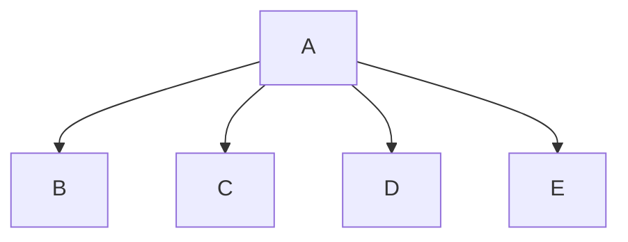

# Chapter-6-Project

# Travel Expenses
Kyle, Mason, Gideon

## Travel Expenses Desc
Outputs the total days on the trip, the time of departure, the amount of round-trip afaire, amount of car rentals,
miles driven, parking fees, taxi fees, conference/seminar registration fees, hotel expenses,
and the amount of each meal eaten.

### Travel Expenses Flowchart

#### Function Diagrams
| `main`    |               |  Kyle     |
| ------------------ | ------------- | ------------ |
| `argument:double`    | takes input from the user for: N/A  |              |
| `time:integer`     | calculates ____  | outputs ____             |
| `name:string`      | takes input for ___ | returns ____ |
***
| `totalDays`    |               |  Kyle     |
| ------------------ | ------------- | ------------ |
| `argument:double`    | takes input from the user for: The total number of days spent on the trip  |              |
| `time:integer`     | calculates N/A  | outputs N/A             |
| `name:string`      | takes input for days | returns days |
***
| `departTime`    |               |     Mason   |
| ------------------ | ------------- | ------------ |
| `argument:double`    | takes input from the user for: The time of departure on the first day of the trip, and the time of arrival back home on the last day of the trip  |              |
| `time:integer`     | calculates N/A  | outputs N/A             |
| `name:string`      | takes input for depart and arrival | returns depart and arrival |
***
| `airfaireCost`    |               |     Mason   |
| ------------------ | ------------- | ------------ |
| `argument:double`    | takes input from the user for: The amount of any round-trip airfare  |              |
| `time:integer`     | calculates N/A  | outputs N/A             |
| `name:string`      | takes input for round-trip | returns round-trip |
***
| `carRentals`    |               |     Gideon   |
| ------------------ | ------------- | ------------ |
| `argument:type`    | takes input from the user for ____  |              |
| `time:integer`     | calculates ______  | outputs ____             |
| `name:string`      | takes input for name ___ | returns total |
***
| `conferenceFees`    |               |     Mason   |
| ------------------ | ------------- | ------------ |
| `argument:type`    | takes input from the user for ____  |              |
| `time:integer`     | calculates ______  | outputs ____             |
| `name:string`      | takes input for name ___ | returns total |
***
| `hotelExpenses`    |               |     Gideon   |
| ------------------ | ------------- | ------------ |
| `argument:type`    | takes input from the user for ____  |              |
| `time:integer`     | calculates ______  | outputs ____             |
| `name:string`      | takes input for name ___ | returns total |
***
| `meals`    |               |     Gideon   |
| ------------------ | ------------- | ------------ |
| `argument:type`    | takes input from the user for ____  |              |
| `time:integer`     | calculates ______  | outputs ____             |
| `name:string`      | takes input for name ___ | returns total |
***
